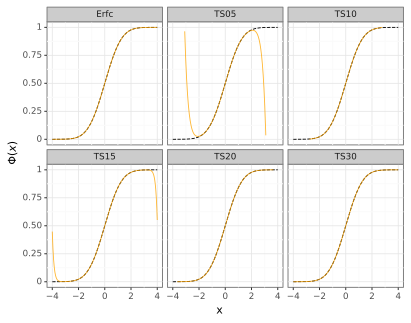

# 0001: Fast and correct computation of the standard normal CDF 


## Introduction 

One of the most fundamental computations in all of probability and statistics is 
computing the CDF of a normal distribution. 
For a normal random variable $X$ with mean $\mu$ and standard deviation $\sigma$, i.e. $X \sim \mathrm{N}(\mu, \sigma)$, 
the normal CDF is given by 
```math
\Phi(x; \mu, \sigma) = \frac{1}{\sigma \sqrt{2 \pi}} \int_{-\infty}^{x} \mathrm{exp} \left( - \frac{(t - \mu)^2}{2 \sigma^2} \right) \,\mathrm{d}t.
```
This integral generally has no closed-form solution, 
so we have to compute $\Phi$ using some numerical scheme. 

As a reminder, for any r.v. $X \sim \mathrm{N}(\mu, \sigma)$, 
by *standardizing* we have $(X - \mu) / \sigma = Z$, 
where $Z \sim \mathrm{N}(0, 1)$ is the standard normal distribution. 
In this case, $\Phi$ is given by 
```math
\Phi(x) = \frac{1}{\sqrt{2 \pi}} \int_{-\infty}^{x} \mathrm{exp} \left( - \frac{t^2}{2} \right) \,\mathrm{d}t.
``` 
This will be "the" $\Phi$ that we will implement, and we can just scale the result to use it for any $\mu$ and $\sigma$. 

Given its popularity, a lot of programming languages (e.g. `Python` or `R`) have an out-of-the-box implementation, which we will look at below. 
Depending on the implementation, the function is either available on its own or as a method of a class, so you would choose depending on the situation. 
Other languagues (e.g. `C++` or `Postgres`) *do not* have an implementation, so you would have to write one on your own. 
You may be able to use some other ready functionality, or have to do it completely from scratch. 

<!-- That being said, in the rest of this post we will do the following: 
- Review current implementations
- Derive a fast algorithm for computing $\Phi$ 
- Implement and compare performance (both accuracy and speed)  -->


## Built-In

### Python 

The `scipy` modules contains a `scipy.stats.norm` object that can compute the CDF. 
It takes in a list of values and computes the CDF like this: 

```python
x_vals: list[float] = [-3.0 + (n * 0.01) for n in range(0, 602)] # values from -3.0 to 3.0 

import numpy as np 
from scipy.stats import norm as Norm 

_: np.ndarray = Norm.cdf(x_vals)
```

Python also has an implementation via the `NormDist` class from the native `statistics` module. 
You can initialize a class and then use list comprehension to compute the values: 

```python
from statistics import NormalDist

norm: NormalDist = NormalDist(0.0, 1.0) 
_: list[float] = [norm.cdf(x_val) for x_val in x_vals] 
```

As an aside, with the setup I did, it seems that the `statistics` method works a bit faster: 

```bash
$ py implementations.py 
Testing normal distribution on 602 values stored in a list of floats ... 
Time of imp01_scipy: 630,600 ns
Time of imp02_statistics: 324,100 ns
```

But this was not a rigorous test; point is, Python has a few ways you can compute this on your own. 


## Implementation 

Now comes the fun part: we want to write an implementation of this on our own. 
For simplicity, our function will only compute $\Phi$ for a single number, without trying to do anything fancy with vectorization. 
Let's try using `C++`. 

Throughout this section we will need to make use of following result: 
```math
\Phi(x) 
% = \frac{1}{\sqrt{2 \pi}} \int_{-\infty}^{x} \mathrm{exp} \left( - \frac{t^2}{2} \right) \,\mathrm{d}t 
= \frac{1}{2} + \frac{1}{\sqrt{2 \pi}} \int_{0}^{x} \mathrm{exp} \left( - \frac{t^2}{2} \right) \,\mathrm{d}t.
```
From a probability perspective, since $0$ is the halfway point along $\mathrm{R}$ and $\Phi$ is symmetric about this point, 
we know all of the probability from $-\infty$ to $0$ is going to be $1 / 2$. 
This has more to do with integrating (a modified) $\mathrm{e}^{-t^2}$, 
its one of those cool things you learn about in multivariable calculus. 
I put a review of this result, and the derivation, in Appendix. 

### Using $\mathrm{Erf}(x)$ and $\mathrm{Erfc}(x)$ 

`C++` has many built-in math functions in the `cmath` header, which we can try to utilize first. 
From the [official documentation](https://en.cppreference.com/w/cpp/header/cmath), 
there is an implementation of the $\mathrm{Erf}$ and $\mathrm{Erfc}$ functions that can be useful. 

The *error function* $\mathrm{Erf}$ is given by 
```math
\mathrm{Erf}(x) 
\coloneqq \frac{2}{\sqrt{\pi}} \int_{0}^{x} \mathrm{exp} \left(- t^2 \right) \,\mathrm{d}t 
```
for all $x \in \mathbb{R}$. 
Note that this function is symmetric, i.e. $\mathrm{Erf}(-x) = - \mathrm{Erf}(x)$. 

The *complimentary error function* $\mathrm{Erfc}(x)$ is given by 
$\mathrm{Erfc}(x) \coloneqq 1 - \mathrm{Erf}(x)$; 
due to symmetry, we have $\mathrm{Erfc}(-x) = 1 - \mathrm{Erf}(-x) = 1 + \mathrm{Erf}(-x)$. 

It turns out that we can use the following relation to compute $\Phi(x)$ from $\mathrm{Erfc}(x)$:  
```math
\Phi(x) 
= \frac{1}{2} \cdot \mathrm{Erfc} \left( - \frac{x}{\sqrt{2}} \right). 
```
A derivation of this can be found in Appendix A. 

This is very easy to implement: 
```C++

using normal_t = double;

constexpr normal_t SQRT_HALF = 0.70710678118; 
auto normalCDF_v1(normal_t x) -> normal_t
{
    return 0.5 * std::erfc(- SQRT_HALF * x); 
}
```
Because anything that's in the standard library will have been tested, we can be assured that these values are correct. 
Going forward, we will use this implementation as the "ground truth" to which compare any other implementation. 

### Using Taylor Series 

One common method of evaluating non-elementary functions such as $\Phi$ is to use a Taylor series expansion. 
We have two ways to go about this: 
1. Take the Taylor series of $\Phi$ directly. 
2. Take the Taylor series of some part of $\Phi$ and use it to simplify. 

Doing 1) is interesting; it gives rise to a recursive pattern in the derivatives (that I may write another post about). 
But computationally, it is not as useful. 
So we instead will implement 2). 
The general process will be to use the Taylor series for $\mathrm{exp}$, 
plug that into $\Phi$, integrate each term, and then boom you have a new Taylor series for $\Phi$. 

Recall that 
```math
\mathrm{exp}(x) 
= \sum_{k=0}^{\infty} \frac{x^k}{k!}.
```

Using this, we can show that 
```math
\Phi(x) 
= \frac{1}{2} + \frac{1}{\sqrt{2\pi}} \int_0^x \sum_{k=0}^{\infty} \frac{(-t^2 / 2)^k}{k!} \,\mathrm{d}t
= \cdots 
= \frac{1}{2} + \frac{1}{\sqrt{2\pi}} \sum_{k=0}^{\infty} \frac{(-1)^k x^{2k + 1}}{2^k k! (2k + 1)}. 
```
At face value this looks a little messy, but it actually is nice because the terms of the series can be derived via recursion. 
If we let $a_k(x)$ represent the $k^{\mathrm{th}}$ term in the series, we have 
```math
a_k(x) = 
\begin{cases}
x & k = 0 \\
-\frac{(2k - 1) x^2}{2k(2k + 1)} \cdot a_{k - 1}(x) & k > 0
\end{cases}.
```

One thing to note about Taylor series is that we need to specify some limit to how many terms we can have. 
Even though theoretically the infinite series is identical to the function, we will only be able to approximate with $N$ terms, i.e. 
$$
\Phi(x) 
\approx \frac{1}{2} + \frac{1}{\sqrt{2\pi}} \sum_{k=0}^{N} \frac{(-1)^k x^{2k + 1}}{2^k k! (2k + 1)}.
$$
As we increase $N$ the accuracy will improve, but it will take longer to compute. 
A balance of both is necessary. 

Here is an implementation: 
```C++
constexpr normal_t ONE_DIV_SQRT_TWO_PI = 0.39894228; 
auto normalCDF_v2(normal_t x, std::size_t N = 5) -> normal_t
{
    if(N == 0){ return 0.5 + (ONE_DIV_SQRT_TWO_PI * x); } 
    normal_t term = x; 
    normal_t total = x; 
    for(std::size_t k = 1; k <= N; ++k)
    {
        term *= - ((k - 0.5) * x * x) / (2.0 * k * (k + 0.5));
        total += term;  
    } 
    return 0.5 + (ONE_DIV_SQRT_TWO_PI * total); 
}
```

If we want to test the accuracy of using Taylor series for $\Phi$, we can plot the values for different values of $N$ 
and compare that to $\mathrm{Erfc}$. I tested the values $N = 5, 10, 15, 20, 30$ over a grid of inputs in the interval $[-3, 3]$: 
<h1 align="center">
    
</h1>

We see that even after only 15 terms, the difference between the Taylor series and $\mathrm{Erfc}$ is very small. 


<!-- ## Appendix 

So, to use this to compute $\Phi(x)$, we can use a change in variable ($u \coloneqq t / \sqrt{2}$) and some more algebra: 
```math
\Phi(x) 
= \frac{1}{\sqrt{2 \pi}} \int_{-\infty}^{x} \mathrm{exp} \left( - \frac{t^2}{2} \right) \,\mathrm{d}t 
= \frac{1}{2} + \frac{1}{\sqrt{2 \pi}} \int_{0}^{x} \mathrm{exp} \left( - \frac{t^2}{2} \right) \,\mathrm{d}t 
= \frac{1}{2} + \frac{1}{\sqrt{2 \pi}} \int_{0}^{x / \sqrt{2}} \mathrm{exp} \left( - u^2 \right) \cdot \sqrt{2} \,\mathrm{d}t 
= \frac{1}{2} + \frac{1}{\sqrt{\pi}} \int_{0}^{x / \sqrt{2}} \mathrm{exp} \left( - u^2 \right) \,\mathrm{d}t 
= \frac{1}{2} \left( 1 + \frac{2}{\sqrt{\pi}} \int_{0}^{x / \sqrt{2}} \mathrm{exp} \left( - u^2 \right) \,\mathrm{d}t \right)
= \frac{1}{2} \left( 1 + \mathrm{Erf}(x / \sqrt{2}) \right)
= \frac{1}{2} \mathrm{Erfc}(- x / \sqrt{2}).
```
This results in the relation: 
```math
\Phi(x) 
= \frac{1}{2} \cdot \mathrm{Erfc} \left( - \frac{x}{\sqrt{2}} \right). 
``` -->