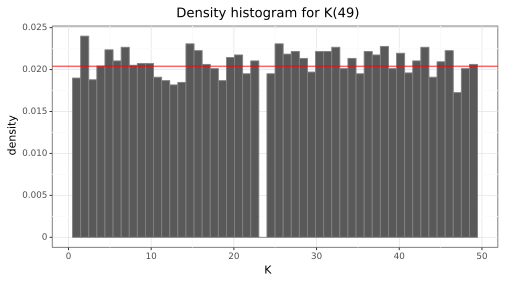
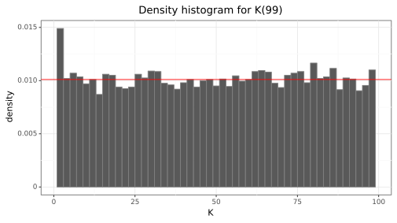
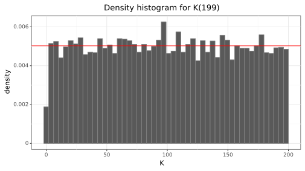
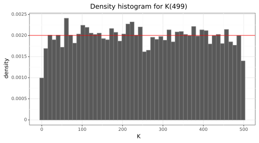

# 0002: Probability question: computing the expected number of removals.


## Question statement

Suppose we start with a set of numbers $[n] \coloneqq \{ 0, 1, \ldots, n - 1 \}$.
We can remove a number from this set with equal probability.
Let us define $K(n)$ to be
*the number of times we have to remove a number from $[n]$ before we remove $0$*.
For example, if we have $n=5$, we would have $[5] = \{ 0, 1, 2, 3, 4 \}$.
Some examples could be removing $(1, 3, 4, 0)$, so $K = 4$,
or removing $(2, 3, 0)$, so $K = 3$.
We want to find the expected value of this random variable, $\mathbb{E}[K(n)]$.


## Build up

We will use $K(5)$ as a concrete example,
but in the end we want a general solution that is written in terms of $n$.

Consider the first selection, where each number has probability $1 / 5$ of being chosen.
So we have a $1/5$ chance of choosing $0$, and a $4/5$ chance of not choosing $0$.
$\mathbb{P}[K(5) = 1] = 1 / 5$, and in general,
```math
\mathbb{P}[K(n) = 1] = \frac{1}{n}.
```

Now consider the second selection.
Having to make a second selection *implies that the number first selected was not $0$*.
For each of the $n - 1$ potential numbers selected previously,
we must now select a second number from a list of $n - 1$ numbers: the full set $[n]$
without the previously selected number.
For example, if we first selected $2$, then we would be selecting a number from
$\{ 0, 1, 3, 4 \}$, a new set of $5 - 1$ elements.

To get a proper count of the total sequences of length $2$,
we can partition the sequences depending on their "group" of previous selections.
For the second selection, the universe of selections are given by
```math
\begin{matrix}
    (\mathit{1}, 0) & (\mathit{1}, 2) & (\mathit{1}, 3) & (\mathit{1}, 4) \\[0.5em]
    (\mathit{2}, 0) & (\mathit{2}, 1) & (\mathit{2}, 3) & (\mathit{2}, 4) \\[0.5em]
    (\mathit{3}, 0) & (\mathit{3}, 1) & (\mathit{3}, 2) & (\mathit{3}, 4) \\[0.5em]
    (\mathit{4}, 0) & (\mathit{4}, 1) & (\mathit{4}, 2) & (\mathit{4}, 3)
\end{matrix}
```
In this case, each *row* corresponds to a group, split by the previous selections
(in this case, only one).
Each group then has $n - 1$ elements (since we are not re-selecting the previous chosen number).

This group break down allows us to compute the number of selections which would result in $0$.
For now let $G(2; n)$ be the number of groups for the second selection
(in a bit we will see that this number is just based on permutations);
in this case, $G(2; 5) = 4$.
Each group will only have a single $0$, and $n - 1$ total elements.
The probability of choosing a selection from this group that contains $0$ is
```math
\frac{\text{Number of groups}}{\text{Number of groups} \cdot \text{number of elements in each group}}
= \frac{G(2; n)}{G(2; n) \cdot (n - 1)}
= \frac{1}{n - 1}.
```

To then get the probability that $K(n) = 2$,
remember that
*having made a second selection implies that the number first selected was not $0$*.
We can think of this then as saying
"the first selection did not contain zero **and** the second selection contains zero".
Because of the sequential relationship between the selections, these two events are independent;
the probability of their intersection is just the product of the individual probabilities.
For $K(5)$, we would have $\mathbb{P}[K(5) = 2] = (4 / 5) \cdot (1 / 4) = 1 / 5$,
and in general,
```math
\mathbb{P}[K(n) = 2]
= \left( 1 - \frac{1}{n} \right) \cdot \frac{1}{n - 1}.
```

Before generalizing, let us consider one more selection such that $K(n) = 3$.
Below is the set of selections for $K(5) = 3$:
```math
\begin{matrix}
    % (\mathit{}, \mathit{}, ) & (\mathit{}, \mathit{}, ) & (\mathit{}, \mathit{}, ) \\[0.5em]
    (\mathit{1}, \mathit{2}, 0) & (\mathit{1}, \mathit{2}, 3) & (\mathit{1}, \mathit{2}, 4) \\[0.5em]
    (\mathit{1}, \mathit{3}, 0) & (\mathit{1}, \mathit{3}, 2) & (\mathit{1}, \mathit{3}, 4) \\[0.5em]
    (\mathit{1}, \mathit{4}, 0) & (\mathit{1}, \mathit{4}, 2) & (\mathit{1}, \mathit{4}, 3) \\[0.5em]
    (\mathit{2}, \mathit{1}, 0) & (\mathit{2}, \mathit{1}, 3) & (\mathit{2}, \mathit{1}, 4) \\[0.5em]
    (\mathit{2}, \mathit{3}, 0) & (\mathit{2}, \mathit{3}, 1) & (\mathit{2}, \mathit{3}, 4) \\[0.5em]
    (\mathit{2}, \mathit{4}, 0) & (\mathit{2}, \mathit{4}, 1) & (\mathit{2}, \mathit{4}, 3) \\[0.5em]
    (\mathit{3}, \mathit{1}, 0) & (\mathit{3}, \mathit{1}, 2) & (\mathit{3}, \mathit{1}, 4) \\[0.5em]
    (\mathit{3}, \mathit{2}, 0) & (\mathit{3}, \mathit{2}, 1) & (\mathit{3}, \mathit{2}, 4) \\[0.5em]
    (\mathit{3}, \mathit{4}, 0) & (\mathit{3}, \mathit{4}, 1) & (\mathit{3}, \mathit{4}, 2) \\[0.5em]
    (\mathit{4}, \mathit{1}, 0) & (\mathit{4}, \mathit{1}, 2) & (\mathit{4}, \mathit{1}, 3) \\[0.5em]
    (\mathit{4}, \mathit{2}, 0) & (\mathit{4}, \mathit{2}, 1) & (\mathit{4}, \mathit{2}, 3) \\[0.5em]
    (\mathit{4}, \mathit{3}, 0) & (\mathit{4}, \mathit{3}, 1) & (\mathit{4}, \mathit{3}, 2) \\[0.5em]
\end{matrix}
```
Again, each *row* represents a group, where the group is determined by the previous two selections.
Here, there are $G(3; 5) = 12$ groups.

The grouping structure now makes it more obvious that the group counting is just permuting:
from the previous selections based off $\{ 1, 2, \ldots, n - 1 \}$,
we are selecting all sequences of length $2$,
which is just the permutation ${}_{n-1}\mathrm{P}_2 = (n - 1)! / 2!$.

Although, again, the actual size of each group doesn't really matter since it cancels out,
we only care about the number of elements in each group.
That is just $n - 2$.

To get the probability for $K(n) = 3$, we again remember that there were now two previous selections
that did not contain $0$.
The same independence argument holds, so we would have
```math
\mathbb{P}[K(n) = 3]
= \left( 1 - \frac{1}{n} \right) \cdot \left( 1 - \frac{1}{n - 1} \right) \cdot \frac{1}{n - 2}.
```


## Formal generalization

We now want to determine $\mathbb{P}[K(n) = k]$
for any value of $k$.
We can figure the following:
- The count of groups in the set of selections is $G(k; n) = {}_{n-1}\mathrm{P}_k = (n - 1)! / k!$.
- Each group will have $n - k + 1$ elements.
- The probability of the $k\!$ th selection containing a $0$ is then just $1 / (n - k + 1)$.
- The probability that the $k\!$ th selection does not contain a $0$ is $1 - 1 / (n - k + 1)$.
- We have to account for the fact that the previous $k - 1$ selections did not contain $0$.

Note that we can write the probability of a selection not containing $0$ as
```math
1 - \frac{1}{n - k + 1}
=\frac{n - k + 1}{n - k + 1} - \frac{1}{n - k + 1}
= \frac{n - k}{n - k + 1}.
```

Combining all this, we can then say
```math
\mathbb{P}[K(n) = k]
= \frac{1}{n - k + 1} \cdot \prod_{\ell=1}^{k - 1} \frac{n - \ell}{n - \ell + 1}.
```
(Note that when $k = 1$, the product's end index is less than the start index,
so it would just equal 1).

This formula can be further simplified due to the "telescoping" nature
of the terms.
For each subsequent product, the next numerator will cancel out the previous denominator.
This leaves us with
```math
\prod_{\ell=1}^{k - 1} \frac{n - \ell}{n - \ell + 1}
= \left( \frac{n - 1}{n} \right) \cdot \left( \frac{n - 2}{n - 1} \right) \cdots \left( \frac{n - k + 1}{n - k} \right)
= \frac{n - k + 1}{n}.
```
Plugging back in gives
```math
\mathbb{P}[K(n) = k]
= \frac{1}{n - k + 1} \cdot \frac{n - k + 1}{n}
= \frac{1}{n}.
```
It is somewhat surprising that every value of $K(n)$ has the same probability of occuring!


## Computing the expected value

To first verify that this is a valid density function, we can check
```math
\sum_{k = 1}^n \mathbb{P}[K(n) = k]
= \sum_{k = 1}^n \frac{1}{n}
= \frac{1}{n} \sum_{k = 1}^n 1
= \frac{1}{n} \cdot n
= 1,
```
so adding over all the probabilities gives $1$.

The expected value is then
```math
\mathbb{E}[K(n)]
= \sum_{k = 1}^n k \cdot \mathbb{P}[K(n) = k]
= \frac{1}{n} \sum_{k = 1}^n k
= \frac{1}{n} \cdot \frac{n(n + 1)}{2}
= \frac{n + 1}{2}.
```


## Verifying with simulation

Lastly, we can test our results by running simulations.
We specifically want to be sure of the following:
1. The formula for the expected value is correct.
2. The density function for $K(n)$ is correct.

The script `simulation.py` has a Python implementation using `numpy`.
We test various values of $n$: $\{ 5, 7, 31, 49, 99, 199, 499 \}$.
Each simulation generates $10,000$ samples from $K(n)$, and then returns the average.

Here is the output of the script,
showing the simulated $\mathbb{E}[K(n)]$ compared to the true value $(n + 1) / 2$:
```bash
> python3 simulation.py

n =   5: Truth =   3.000 vs. Simulation =   3.031
n =   7: Truth =   4.000 vs. Simulation =   3.997
n =  31: Truth =  16.000 vs. Simulation =  15.988
n =  49: Truth =  25.000 vs. Simulation =  25.044
n =  99: Truth =  50.000 vs. Simulation =  50.284
n = 199: Truth = 100.000 vs. Simulation =  99.820
n = 499: Truth = 250.000 vs. Simulation = 249.355
```

Here are some of the density plots from the simulations,
which were created in the `make_plots.py` script:






We see that the simulated sample averages match closely
to the theoretical expected values.
In addition, the histograms mostly match the theory that each value of $K(n)$
can occur with equal probability.
