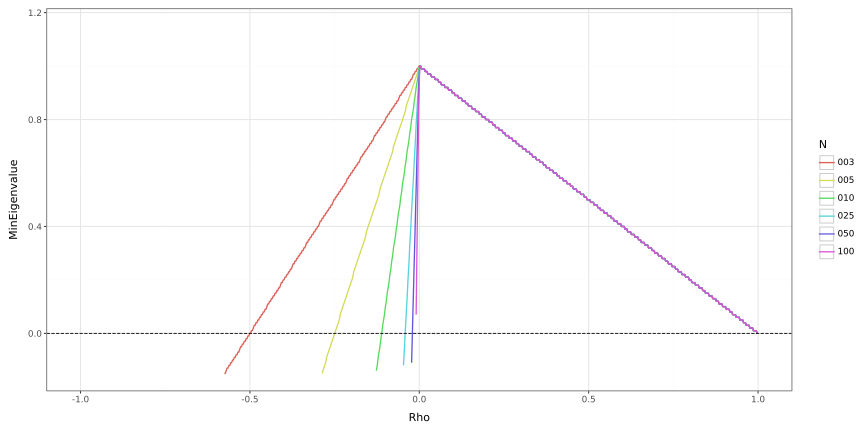

# 0004: Determining if an "approximate" correlation matrix is PSD

## Introduction

For a set of $p$ random variables $X_1, \ldots, X_p = \mathbf{x} \in \mathbb{R}^p$
(assume that $\mathbb{E}[\mathbf{x}] = \mathbf{0}$),
it is useful to examine its *covariance matrix*
```math
\mathbf{C}
= \mathbb{V}\mathrm{ar}[\mathbf{x}]
= \mathbb{E}[\mathbf{x} \mathbf{x}^\top].
```
If you have $n$ observations of $\mathbf{x}$
stored in the matrix $\mathbf{X} \in \mathbb{R}^{n \times p}$,
we can look at the *sample covariance matrix*
```math
\mathbf{C}
= \frac{1}{n - 1} \mathbf{X}^\top \mathbf{X}.
```
By design, this matrix will be positive semi-definite (PSD);
i.e., $\mathbf{w}^\top \mathbf{C} \mathbf{w} \ge 0$
for all non-zero vectors $\mathbf{w} \in \mathbb{R}^p$.
<!--
TODO: add links to proofs of these
https://statproofbook.github.io/P/covmat-psd.html
-->

As an example from finance,
suppose you have a portfolio containing $p$ assets.
If $X_i$ is the change/shock of asset $i$
and $w_i$ is portfolio's dollar position of asset $i$
(for some horizon, e.g., 1 day),
then the change in portfolio value over this horizion is
```math
\sum_{i = 1}^p w_i X_i
= \mathbf{w}^\top \mathbf{x}.
```
We can then measure the variance of this change as
```math
\mathbb{V}\mathrm{ar}[\mathbf{w}^\top \mathbf{x}]
= \mathbf{w}^\top \mathbb{V}\mathrm{ar}[\mathbf{x}] \mathbf{w}
= \mathbf{w}^\top \mathbf{C} \mathbf{w}.
```

An alternative way of looking at these computations is the *correlation matrix*,
$\mathbf{R}$.
Suppose for variable $i$ we have the standard deviation $s_i$,
which we can store in a vector $\mathbf{s} \in \mathbb{R}^p$.
If we define the diagonal matrix $\mathbf{S} = \mathrm{diag}(\mathbf{s})$,
we can relate the covariance and correlation matrices with
```math
\begin{align*}
    \mathbf{C} &= \mathbf{S}^\top \mathbf{R} \mathbf{S}, \\
    \mathbf{R} &= \mathbf{S}^{-\top} \mathbf{C} \mathbf{S}^{-1}. \\
\end{align*}
```
Our quadratic form can then be written as
```math
\mathbf{w}^\top \mathbf{C} \mathbf{w}
= \mathbf{w}^\top (\mathbf{S}^\top \mathbf{R} \mathbf{S}) \mathbf{w}
= (\mathbf{S} \mathbf{w})^\top \mathbf{R} (\mathbf{S} \mathbf{w})
= \tilde{\mathbf{w}}^\top \mathbf{R} \tilde{\mathbf{w}}.
```

Given that $\mathbf{C}$ is PSD,
it follows that $\mathbf{R}$ is PSD as well.
<!--
TODO: add proof of this
-->

However, suppose for whatever reason,
you are not able to empirically determine the covariance/correlation
between every variable.
Thinking back to the finance example,
you could have a new instrument in your portfolio
without enough historical data to compute the correlations with other assets
(and despite this, you still decide to include it in your portfolio :P).
In this case, you could *approximate* the correlation with another value.
In an extreme case, you might make the (very rigid) assumption that
the correlation between every element is the same.

We can look at this *approximation correlation matrix* $\mathbf{Q}$,
whose elements are given by
```math
q_{i,j}
=
\begin{cases}
    1& i = j, \\
    \rho& i \neq j.
\end{cases}
```
That is, every element still has correlation $1$ with itself,
but you assume it has correlation $\rho$ with every other element.
Our variance would then be approximated by
```math
\mathbb{V}\mathrm{ar}[\mathbf{w}^\top \mathbf{x}]
= \tilde{\mathbf{w}}^\top \mathbf{R} \tilde{\mathbf{w}}
\approx \tilde{\mathbf{w}}^\top \mathbf{Q} \tilde{\mathbf{w}}.
% = \sum_{i = 1}^p \tilde{w}_i^2 + \rho \sum_{i = 1}^p \sum_{j = 1}^p \tilde{w}_i \tilde{w}_j
```
<!--
TODO: figure out how to put i \neq j in subscript
-->

While the full correlation matrix $\mathbf{R}$ is PSD,
it may not be true that the approximate matrix $\mathbf{Q}$ is.
That brings us to the purpose of this post:
*when is the matrix $\mathbf{Q}$ PSD?*

## Looking at eigenvalues

One way to show a matrix is PSD is to look at its eigenvalues:
*if all of the eigenvalues are non-negative,
then the matrix is PSD*.
We can find the eigenvalues by solving the polynomial equation
```math
P(\lambda)
= \mathrm{det}(\mathbf{Q} - \lambda \mathbf{I})
\overset{\text{set}}{=} 0.
```
For some notation,
let $\mathbf{Q}_n$ specify the dimensionality $n$
<!-- and let $\mathbf{G}_n = \mathbf{Q}_n - \lambda \mathbf{I}_n$. -->
and let
```math
\mathbf{G}_n
= \mathbf{Q}_n - \lambda \mathbf{I}_n
=
\begin{bmatrix}
    1 - \lambda & \rho & \cdots & \rho \\
    \rho & 1 - \lambda & \cdots & \rho \\
    \vdots & \vdots & \ddots & \vdots \\
    \rho & \rho & \cdots & 1 - \lambda
\end{bmatrix}
=
\begin{bmatrix}
    \gamma & \rho & \cdots & \rho \\
    \rho & \gamma & \cdots & \rho \\
    \vdots & \vdots & \ddots & \vdots \\
    \rho & \rho & \cdots & \gamma
\end{bmatrix},
```
where $\gamma = 1 - \lambda$.
We are going to try and find a formula for
$\det(\mathrm{G}_n)$ for any $n$.
It's good to first example specific cases,
and see if we can see an emerging pattern.

### $n = 2$

We have
```math
\mathrm{det}(\mathbf{G}_2)
= \mathrm{det}
\begin{bmatrix}
    \gamma & \rho \\ \rho & \gamma
\end{bmatrix}
= \gamma^2 - \rho^2
= (\gamma - \rho)(\gamma + \rho).
```

### $n = 3$

Using the Leibniz formula for computing determinants gives us
```math
\mathrm{det}(\mathbf{G}_3)
= \mathrm{det}
\begin{bmatrix}
    \gamma & \rho & \rho \\
    \rho & \gamma & \rho \\
    \rho & \rho & \gamma
\end{bmatrix}
=
\gamma
\begin{bmatrix}
    \gamma & \rho \\ \rho & \gamma
\end{bmatrix}
- \rho
\begin{bmatrix}
    \rho & \rho \\ \rho & \gamma
\end{bmatrix}
+ \rho
\begin{bmatrix}
    \rho & \gamma \\ \rho & \rho
\end{bmatrix}.
```
From this sum, we see two "types" of terms:
- A matrix with two $\gamma$ terms, being multiplied by $\gamma$.
- A matrix with one $\gamma$ term, being multiplied by $\rho$.

However, we can re-arrange the second type to
move all the $\gamma$ term to the upper-left corner,
giving us
```math
\begin{align*}
\mathrm{det}(\mathbf{G}_3)
&=
\gamma
\begin{bmatrix}
    \gamma & \rho \\ \rho & \gamma
\end{bmatrix}
- \rho
\begin{bmatrix}
    \rho & \rho \\ \rho & \gamma
\end{bmatrix}
+ \rho
\begin{bmatrix}
    \rho & \gamma \\ \rho & \rho
\end{bmatrix} \\
&=
\gamma
\begin{bmatrix}
    \gamma & \rho \\ \rho & \gamma
\end{bmatrix}
- \rho
\begin{bmatrix}
    \gamma & \rho \\ \rho & \rho
\end{bmatrix}
- \rho
\begin{bmatrix}
    \gamma & \rho \\ \rho & \rho
\end{bmatrix} \\
&=
\gamma
\begin{bmatrix}
    \gamma & \rho \\ \rho & \gamma
\end{bmatrix}
- 2 \rho
\begin{bmatrix}
    \gamma & \rho \\ \rho & \rho
\end{bmatrix}.
\end{align*}
```
We could try to then reduce the $2 \times 2$ matrices here,
but we already solved the first one in the previous iteration;
that is just $\mathbf{G}_2$.
Let's hold off for now
and instead try to find a recursive pattern.

### $n = 4$

Using the same logic as before, we get
```math
\begin{align*}
\mathrm{det}(\mathbf{G}_4)
&= \mathrm{det}
\begin{bmatrix}
    \gamma & \rho & \rho & \rho \\
    \rho & \gamma & \rho & \rho \\
    \rho & \rho & \gamma & \rho \\
    \rho & \rho & \rho & \gamma
\end{bmatrix} \\
&=
\gamma
\begin{vmatrix}
    \gamma & \rho & \rho \\
    \rho & \gamma & \rho \\
    \rho & \rho & \gamma
\end{vmatrix}
- \rho
\begin{vmatrix}
    \rho & \rho & \rho \\
    \rho & \gamma & \rho \\
    \rho & \rho & \gamma
\end{vmatrix}
+ \rho
\begin{vmatrix}
    \rho & \gamma & \rho \\
    \rho & \rho & \rho \\
    \rho & \rho & \gamma
\end{vmatrix}
- \rho
\begin{vmatrix}
    \rho & \gamma & \rho \\
    \rho & \rho & \gamma \\
    \rho & \rho & \rho
\end{vmatrix} \\
&=
\gamma
\begin{vmatrix}
    \gamma & \rho & \rho \\
    \rho & \gamma & \rho \\
    \rho & \rho & \gamma
\end{vmatrix}
- \rho
\begin{vmatrix}
    \gamma & \rho & \rho \\
    \rho & \gamma & \rho \\
    \rho & \rho & \rho
\end{vmatrix}
- \rho
\begin{vmatrix}
    \gamma & \rho & \rho \\
    \rho & \gamma & \rho \\
    \rho & \rho & \rho
\end{vmatrix}
- \rho
\begin{vmatrix}
    \gamma & \rho & \rho \\
    \rho & \gamma & \rho \\
    \rho & \rho & \rho
\end{vmatrix} \\
&=
\gamma
\;\mathrm{det} 
\begin{bmatrix}
    \gamma & \rho & \rho \\
    \rho & \gamma & \rho \\
    \rho & \rho & \gamma
\end{bmatrix}
- 3 \rho
\;\mathrm{det} 
\begin{bmatrix}
    \gamma & \rho & \rho \\
    \rho & \gamma & \rho \\
    \rho & \rho & \rho
\end{bmatrix}.
\end{align*}
```
We have a similar pattern as before;
we see $\mathrm{det}(\mathbf{G}_3)$ being multiplied by $\gamma$,
and subtracting away the determinant of a matrix
with all diagonal entries $\gamma$ except for the last entry,
being multiplied by some multiple of $\rho$.
Here $n = 4$; the two subsequent matrices are $3 \times 3$,
and the $\rho$ is being multiplied by $3$, both one less than $4$.
For a general $n$,
this value would generalize to $n - 1$.

### General $n$

For the matrix of all $\gamma$ except for the last diagonal entry,
let's call it
```math
\mathbf{H}_n
=
\begin{bmatrix}
    \gamma & \rho & \cdots & \rho \\
    \rho & \gamma & \cdots & \rho \\
    \vdots & \vdots & \ddots & \vdots \\
    \rho & \rho & \cdots & \rho
\end{bmatrix}.
```
We can then write, for general $n$,
```math
\mathrm{det}(\mathbf{G}_n)
= \gamma \,\mathrm{det}(\mathbf{G}_{n - 1})
- (n - 1) \rho \,\mathrm{det} (\mathbf{H}_{n - 1}).
```
So, if we first are able to figure the value of $\mathrm{det}(\mathbf{H}_n)$,
we can then determine $\mathrm{det}(\mathbf{G}_n)$.

## Recursive formula for $\mathrm{det}(\mathbf{H}_n)$

Similar to before, lets look at some examples.
The base case, $n = 1$,
has $\mathrm{det}(\mathbf{H}_1) = \rho$.

### $n = 2$

We have
```math
\mathrm{det}(\mathbf{H}_2)
= \mathrm{det}
\begin{bmatrix}
\gamma & \rho \\ \rho & \rho
\end{bmatrix}
= \gamma \rho - \rho^2
= (\gamma - \rho) \rho
= (\gamma - \rho) \,\mathrm{det}(\mathbf{H}_1).
```

### $n = 3$

We have
```math
\begin{align*}
\mathrm{det}(\mathbf{H}_3)
&= \mathrm{det}
\begin{bmatrix}
\gamma & \rho & \rho \\
\rho & \gamma & \rho \\
\rho & \rho & \rho
\end{bmatrix}
=
\gamma
\begin{vmatrix}
\gamma & \rho \\ \rho & \rho
\end{vmatrix}
- \rho
\begin{vmatrix}
\rho & \rho \\ \rho & \rho
\end{vmatrix}
+ \rho
\begin{vmatrix}
\rho & \gamma \\ \rho & \rho
\end{vmatrix} \\
&=
\gamma
\begin{vmatrix}
\gamma & \rho \\ \rho & \rho
\end{vmatrix}
- \rho
\begin{vmatrix}
\gamma & \rho \\ \rho & \rho
\end{vmatrix}
= (\gamma - \rho) \,\mathrm{det}(\mathbf{H}_2).
\end{align*}
```

### General $n$

We generally see that
```math
\mathrm{det}(\mathbf{H}_n)
= (\gamma - \rho) \,\mathrm{det}(\mathbf{H}_{n - 1}).
```
And since $\mathrm{det}(\mathbf{H}_n) = \rho$, we have
```math
\mathrm{det}(\mathbf{H}_n)
= \rho (\gamma - \rho)^{n - 1}.
```

## Back to solving $\mathrm{det}(\mathbf{G}_n)$

Using our new formula for $\mathrm{det}(\mathbf{H}_n)$,
we can now write
```math
\mathrm{det}(\mathbf{G}_n)
% = \gamma \,\mathrm{det}(\mathbf{G}_{n - 1})
% - (n - 1) \rho \,\mathrm{det} (\mathbf{H}_{n - 1})
= \gamma \,\mathrm{det}(\mathbf{G}_{n - 1})
- (n - 1) \rho^2 (\gamma - \rho)^{n - 2}.
```
This isn't super useful right now,
but if we can make a guess as to the value for $\mathrm{det}(\mathbf{G}_n)$,
we can then prove it using induction with this formula.
To make that guess, let's go back to some of
the specific values of $n$ we computed earlier.

We know as a base case that $\mathrm{det}(\mathbf{G}_1) = \gamma$,
and we saw before that
```math
\mathrm{det}(\mathbf{G}_2) = (\gamma - \rho)(\gamma + \rho).
```
If we use this to evaulate $\mathrm{det}(\mathbf{G}_3)$, we have
```math
\begin{align*}
\mathrm{det}(\mathbf{G}_3)
&=
\gamma
\, \mathrm{det}(\mathbf{G}_2)
- 2 \rho^2 (\gamma - \rho) \\
&=
\gamma
(\gamma - \rho)(\gamma + \rho)
- 2 \rho^2 (\gamma - \rho) \\
&=
(\gamma - \rho) \Big[ \gamma (\gamma + \rho) - 2 \rho^2 \Big] \\
&=
(\gamma - \rho) \Big[ \gamma^2 + \rho \gamma - 2 \rho^2 \Big] \\
&=
(\gamma - \rho) \Big[ (\gamma - \rho)(\gamma + 2 \rho) \Big] \\
&=
(\gamma - \rho)^2(\gamma + 2 \rho).
\end{align*}
```
A general pattern, perhaps, starts to emerge;
it looks that
```math
\mathrm{det}(\mathbf{G}_n)
= (\gamma - \rho)^{n - 1} \big( \gamma + (n - 1)\rho \big).
```
Let's try using this in the recursive formula via induction:
```math
\begin{align*}
\mathrm{det}(\mathbf{G}_{n + 1})
&=
\gamma
\, \mathrm{det}(\mathbf{G}_n)
- n \rho^2 (\gamma - \rho)^{n - 1} \\
&=
\gamma
(\gamma - \rho)^{n - 1} \big( \gamma + (n - 1)\rho \big)
- n \rho^2 (\gamma - \rho)^{n - 1} \\
&=
(\gamma - \rho)^{n - 1} \bigg[ \gamma \big( \gamma + (n - 1)\rho \big) - n \rho^2 \bigg] \\
&=
(\gamma - \rho)^{n - 1} \bigg[ \gamma^2 + (n - 1)\rho \gamma - n \rho^2 \bigg] \\
&=
(\gamma - \rho)^{n - 1} \bigg[ (\gamma - \rho) ( \gamma + n \rho ) \bigg] \\
&=
(\gamma - \rho)^{n} ( \gamma + n \rho ).
\end{align*}
```
Which shows our formula is correct.

## Analyzing the eigenvalues

After all that, we have
```math
\mathrm{det}(\mathbf{G}_n)
= (\gamma - \rho)^{n - 1} \big( \gamma + (n - 1)\rho \big).
```
This shows there are two unique roots:
- $\gamma = \rho$ (with multiplicity $n - 1$).
- $\gamma = -(n - 1) \rho$ (with multiplicity $1$).

Solving back for the original eigenvalues, substituting $\gamma = 1 - \lambda$, we have:
- $\lambda = 1 - \rho$ (with multiplicity $n - 1$).
- $\lambda = 1 + (n - 1) \rho$ (with multiplicity $1$).

Let's call the first eigenvalue $\lambda_1 = 1 - \rho$,
and the second $\lambda_2 = 1 + (n - 1) \rho$.
For $\mathbf{Q}$ to be PSD,
we need both $\lambda_1 \ge 0$
and $\lambda_2 \ge 0$.
Solving for $\rho$ from each gives an interval for $\rho$:
```math
\begin{align*}
- \frac{1}{n - 1}
\le \rho
\le 1.
\end{align*}
```
As long as $\rho$ is within this interval,
our approximation matrix $\mathbf{Q}_n$ is PSD.

Correlations are always $\le 1$,
so the upper bound is no problem.
However, we can see the lower bound approaches $0$ as $n \to \infty$;
the set of valid negative values of $\rho$ is very limited,
especially for large $n$.
Ideally, our approximation should be using a positive $\rho$,
since that will *always* be PSD.

## Verifying via computation

For a given pair of $(n, \rho)$,
we can compute the minimum eigenvalue of $\mathbf{Q}$.
This is shown in the plot below:

<h1 align="center">
    
</h1>

We can see how quickly the lower bound on $\rho$ goes to $0$.